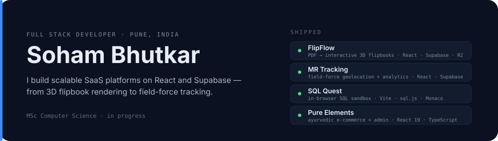

  

  
  

---

### 🚀 Featured Projects

| Project | What it does | Tech |
| :--- | :--- | :--- |
| **[VC Scanner](https://github.com/Soham407/VC-Scanner)** · [live](https://vc-scanner-iota.vercel.app) | Business-card scanner: on-device OCR on mobile, plus a separate admin web app for parsing and managing captures. | `Expo` `React Native` `ML Kit` `Supabase` `Groq` |
| **[SOLVESXX](https://github.com/Soham407/Solvesxx_web)** · [live](https://facilitypro-vert.vercel.app) | Facility operations cloud for Powerful Solutions Pvt Ltd — workforce coordination, procurement and service management. | `Next.js` `TypeScript` `Supabase` `PLpgSQL` |
| **[studio-kickstart](https://github.com/Soham407/studio-kickstart)** · [npm](https://www.npmjs.com/package/studio-kickstart) | Published CLI (`npx studio-kickstart`) that bootstraps agent-ready Next.js, Expo and Solito projects with auth, tests, formatting and guardrails preconfigured. | `Node` `CLI` `Better-Auth` `WatermelonDB` |
| **[Orvion IntelliAct](https://github.com/Soham407/Orvion-IntelliAct)** · [live](https://orvion-intelli-act.vercel.app) | Platform for an industrial automation firm covering power, chemicals, refineries and water SCADA. | `Next.js` `Supabase` `GSAP` |
| **[Think UX](https://github.com/Soham407/Thinkux)** · [live](https://thinkux.vercel.app) | Portfolio platform for a design and branding agency, built around an animation-heavy asset strategy. | `Next.js` `Framer Motion` |
| **[FlipFlow](https://github.com/Soham407/FlipFlow)** · [live](https://flip-flow.vercel.app) | SaaS that turns static PDFs into interactive 3D flipbooks, with tiered subscriptions and hybrid storage. | `React` `Supabase` `Cloudflare R2` |

---

### 👨‍💻 About

Performance-driven Full Stack Developer in **Pune, India**, currently pursuing a **Master's in Computer Science**. I build scalable **SaaS**, **EdTech** and **enterprise** systems across the React ecosystem — shipped for clients in **healthcare** and **sales**.

- 🔭 Working on high-performance SaaS architectures with **Supabase & Cloudflare R2**
- 🌱 Exploring **agentic AI workflows** and advanced system design
- ⚡ Once built a pixel-perfect **[macOS replica](https://github.com/Soham407/MacOs-Portfolio)** that runs entirely in the browser

---

### 🛠️ Tech Stack

| **Frontend** | **Backend & BaaS** | **Languages** | **Tools & AI** |
| :---: | :---: | :---: | :---: |
|  |  |  |  |

---

### 📊 GitHub Activity

  

